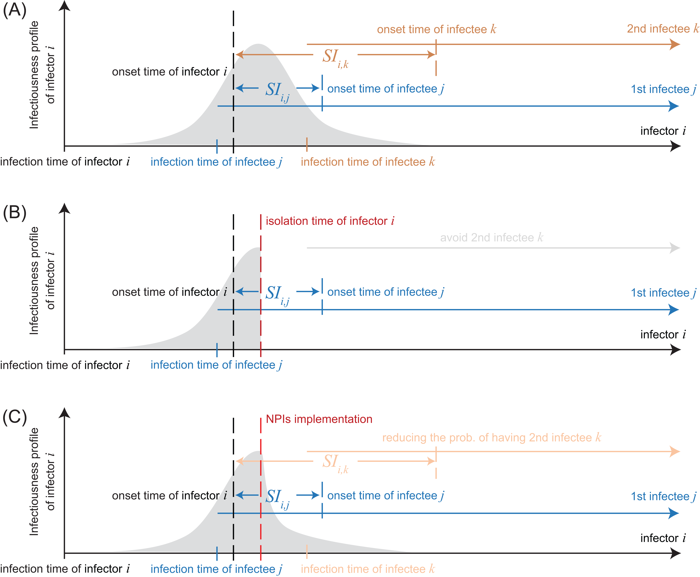

# Serial interval of SARS-CoV-2 was shortened over time by non-pharmaceutical interventions

## Abstract

Studies of novel coronavirus disease (COVID-19) have reported varying estimates of epidemiological parameters including serial interval distributions, i.e. the time between illness onset in successive cases in a transmission chain, and reproduction numbers. By compiling a line-list database of transmission pairs in mainland China, we show that mean serial intervals of COVID-19 have shortened substantially from 7.8 days to 2.6 days within a month (January 9 to February 13, 2020). This change is driven by enhanced non-pharmaceutical interventions, in particular case isolation. We also show that using real-time estimation of serial intervals allowing for variation over time, provides more accurate estimates of reproduction numbers than using conventionally fixed serial interval distributions. These findings would improve assessment of transmission dynamics, forecasting future incidence, and estimating the impact of control measures.

Published at Science: https://science.sciencemag.org/content/early/2020/07/20/science.abc9004   

## Data and code description

[Transmission Pairs data](/raw_data/TableS1_1407TransPairs.csv)

[Timeline data of each NPI in mainland China](/raw_data/NPI_data_FigS7.csv)

Most codes are ready in this [folder](/code). A few more will be uploaded soon.


## Mechanisms underlying the observed patterns (Figure S1 in the published paper)



From the view of a single transmission pair, serial interval depends on the infectiousness profile of the infector and the incubation period of the infectee. On the other hand, from the view of each infector, the realized serial intervals may not only depend on the properties of each transmission pair (i.e., infectiousness profile, incubation period) but may also depend on the properties of contacts (e.g., contact patterns, structure of contacts). Fig. S1(A) illustrates the effect of these basic factors on shaping serial interval distribution. 
The influence of non-pharmaceutical intervals (NPIs) on re-shaping serial interval distribution can be understood from two aspects (Fig. S1 (B)-(C)). On one hand, the implementation of NPIs via enhanced contact tracing and scaling up testing capacities reduced the time delay in isolating cases (Fig. S2 in the published paper), which reduces the period of infectiousness and hence truncates the exposure window for susceptible individuals to acquire infection. On the other hand, the NPI-induced truncation on the period of infectiousness may also reduce or even avoid the generation of some secondary cases, skewing the serial interval distribution to the left.


## Authors

Name | Email | Twitter / WeChat | Github
------------ | ------------- | ------------- | -------------
Sheikh Taslim Ali | alist15@hku.hk | @alisheikhtaslim | @alisheikhtaslim 
Lin Wang | lw660@cam.ac.uk | @fdlwang | @PDGLin
Eric HY Lau | ehylau@hku.hk | @erichylau  |  @ehylau
Xiao-Ke Xu | xuxiaoke@foxmail.com | xiaokeeie  |
Zhanwei Du | duzhanwei0@gmail.com | @du8491 | @ZhanweiDU 
Ye Wu | wuye@bnu.edu.cn |   |   
Gabriel M. Leung | deanmed@hku.hk | @gmleunghku |   
Benjamin J. Cowling | bcowling@hku.hk | @bencowling88  |   


## Citation

```{bibtex}
@misc{Ali2020SerialInterval,
  author =       {S.T. Ali, L. Wang, E.H.Y. Lau, X.-K. Xu, Z. Du, Y. Wu, G.M. Leung, B.J. Cowling },
  title =        {Serial interval of SARS-CoV-2 was shortened over time by non-pharmaceutical interventions},
  howpublished = {Accessed on 2020-07-21 from \url{https://science.sciencemag.org/content/early/2020/07/20/science.abc9004}},
  year =         2020
  journal =      Science
}
```

